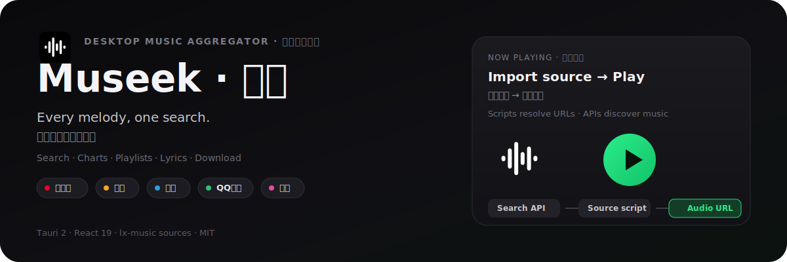
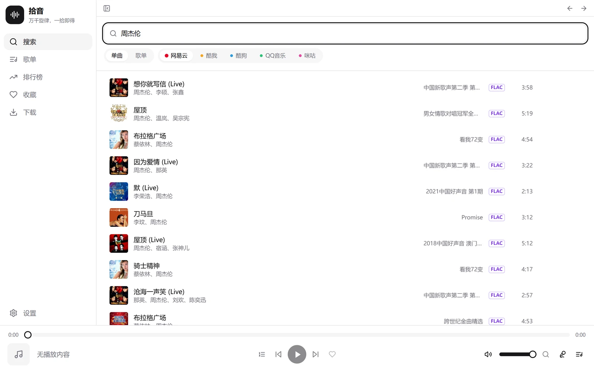
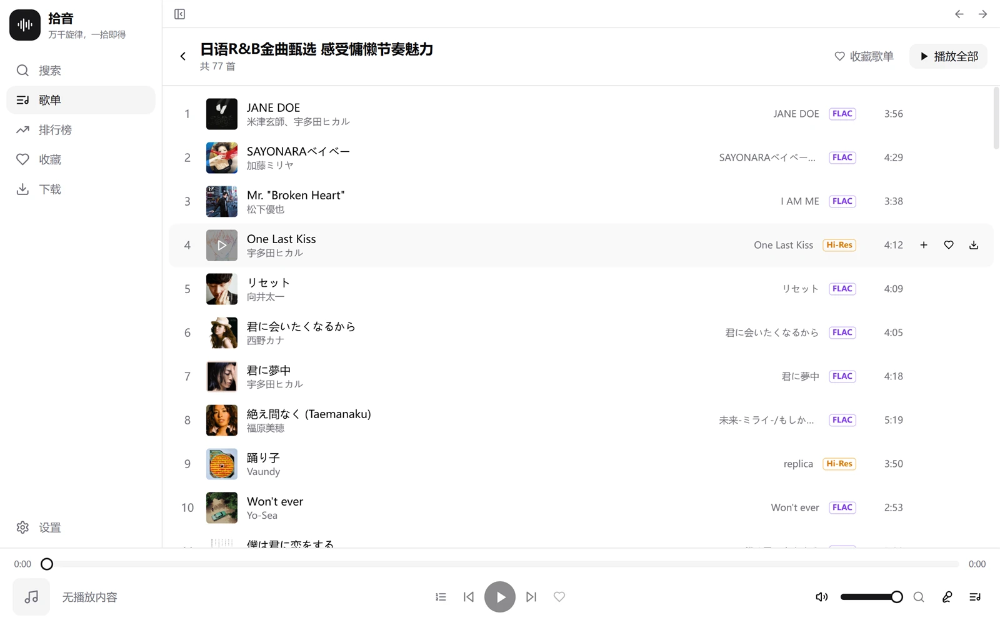
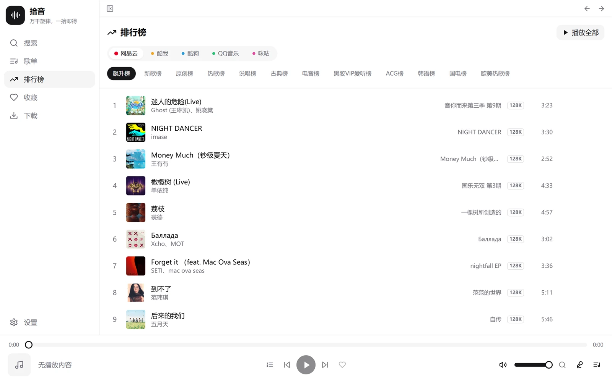
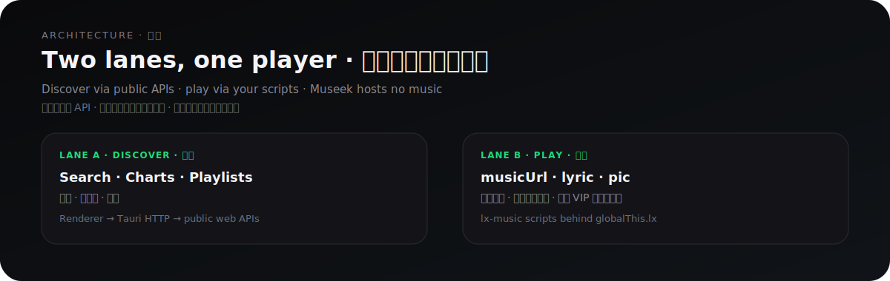

<div align="center">



</div>

<h1 align="center">Museek · 拾音</h1>

<p align="center">
  <em>Every melody, one search. · 万千旋律，一拾即得。</em>
</p>

<p align="center">
  
  
  
  
  
</p>

**Museek** is a cross-platform desktop music aggregator: search, charts, playlists, synced lyrics, and downloads across **NetEase · KuWo · KuGou · QQ Music · Migu** — in one app.

**拾音**是跨平台桌面音乐聚合应用：搜索、排行榜、歌单、同步歌词与下载，覆盖网易云 / 酷我 / 酷狗 / QQ 音乐 / 咪咕。

> [!IMPORTANT]
> Museek ships **no** music sources or content. Playback links come from **your** lx-music–compatible source scripts; search / charts / playlists use public platform APIs. See [Disclaimer](#disclaimer).
>
> 拾音**不提供**任何音乐源或内容。播放链接来自**你导入的**兼容 lx-music 音源脚本；搜索 / 排行榜 / 歌单调用各平台公开 API。详见[免责声明](#disclaimer)。

---

## Proof · 界面

<div align="center">


</div>

|  |  |  |
| :---: | :---: | :---: |
| Search · 搜索 | Playlist · 歌单 | Charts · 排行榜 |

---

<div align="center">


</div>

| | English | 中文 |
| --- | --- | --- |
| **Discover · 发现** | Search songs, playlists, and users across five platforms; browse charts and hot playlists; trending word cloud on empty search. | 五平台搜索单曲 / 歌单 / 用户；排行榜与热门歌单；空搜索页热词云。 |
| **Sources · 音源** | Import lx-music scripts by URL (paste several at once). Multi-source failover; skips short VIP trial clips. | 链接导入音源（可一次粘贴多条）。多源失败转移；跳过 VIP 试听提示音。 |
| **Player · 播放器** | Queue, shuffle / repeat, quality auto-downgrade, immersive synced lyrics, Windows SMTC / macOS Now Playing, keyboard shortcuts. | 队列与循环模式、音质自动降级、沉浸歌词、系统媒体控制、键盘快捷键。 |
| **Library · 收藏库** | Favorite songs & whole playlists; batch download; disk cache for audio / lyrics / covers. | 收藏单曲与歌单；批量下载；音频 / 歌词 / 封面本地缓存。 |
| **Desktop · 桌面** | Light / dark / system themes, EN / 简体中文, tray close behavior, prevent-sleep while playing, encrypted cloud-folder sync. | 主题与中英界面、托盘关闭、播放防休眠、网盘文件夹加密同步。 |

---

<div align="center">



</div>

Search / charts / playlists hit public web APIs through Tauri’s HTTP plugin. Playback URLs come from lx-music–compatible scripts running behind `globalThis.lx` — Museek only handles `musicUrl` / `lyric` / `pic`.

搜索 / 排行榜 / 歌单经 Tauri HTTP 调用公开 Web API。播放链接由兼容 lx-music 的音源脚本解析（`globalThis.lx`）—— 拾音只处理 `musicUrl` / `lyric` / `pic`。

---

<div align="center">


</div>

### Prerequisites · 环境

- [Node.js](https://nodejs.org/) 18+ and [pnpm](https://pnpm.io/)<br>[Node.js](https://nodejs.org/) 18+ 与 [pnpm](https://pnpm.io/)
- [Rust](https://www.rust-lang.org/tools/install) stable<br>[Rust](https://www.rust-lang.org/tools/install) 工具链（stable）
- Tauri 2 [system prerequisites](https://tauri.app/start/prerequisites/) (Windows: WebView2 + MSVC)<br>Tauri 2 的[系统依赖](https://tauri.app/start/prerequisites/)（Windows 需 WebView2 + MSVC）

### Develop · 开发

```bash
pnpm install
pnpm tauri dev
```

Install deps, then run the desktop app in dev mode.  
安装依赖后，以开发模式启动桌面应用。

### Build · 打包

```bash
# Windows → NSIS setup.exe (installer UI follows OS language: Chinese / English)
# Windows → NSIS setup.exe（安装界面随系统语言自动中/英文）
# Requires updater signing key in the environment (see Auto-update below).
# 需在环境中配置更新签名私钥（见下方「应用内更新」）。
pnpm tauri build

# macOS Apple Silicon → DMG + updater .app.tar.gz (build on Apple Silicon)
# macOS Apple Silicon → DMG + 应用内更新用 .app.tar.gz（需在 Apple Silicon Mac 上构建）
pnpm tauri build -- --target aarch64-apple-darwin --bundles app,dmg
```

Installers land in `src-tauri/target/*/release/bundle/` (Windows: NSIS `setup.exe`; macOS: `.dmg` + `.app.tar.gz` for in-app updates), plus updater `.sig` artifacts when signing is configured.  
打包产物位于 `src-tauri/target/*/release/bundle/`（Windows：NSIS `setup.exe`；macOS：`.dmg` 与应用内更新用 `.app.tar.gz`）；配置签名后还会生成 updater 用的 `.sig`。

### Auto-update · 应用内更新

In-app updates use [`tauri-plugin-updater`](https://v2.tauri.app/plugin/updater/) against  
`https://github.com/aeroray/Museek/releases/latest/download/latest.json`.  
应用内更新使用官方 [`tauri-plugin-updater`](https://v2.tauri.app/plugin/updater/)，清单地址同上（GitHub Releases 上的 `latest.json`）。

**Signing keys · 签名密钥**（never commit the private key · 私钥勿提交仓库）

```bash
# Example local paths · 本机示例路径：
#   %USERPROFILE%\.tauri\museek.key      — private · 私钥
#   %USERPROFILE%\.tauri\museek.key.pub  — public · 公钥（已写入 tauri.conf.json）

# Local signed build · 本地签名构建：
set TAURI_SIGNING_PRIVATE_KEY_PATH=%USERPROFILE%\.tauri\museek.key
pnpm tauri build
```

**GitHub Actions secrets · CI 密钥**

| Secret | English | 中文 |
| --- | --- | --- |
| `TAURI_SIGNING_PRIVATE_KEY` | Full contents of `museek.key` | `museek.key` 的完整内容 |
| `TAURI_SIGNING_PRIVATE_KEY_PASSWORD` | Password if the key has one (omit / empty if none) | 若密钥有密码则填写；无密码可省略或留空 |

Tag a release (`git tag vX.Y.Z && git push origin vX.Y.Z`). The Release workflow uploads installers, `.sig` files, and `latest.json` (`includeUpdaterJson: true`). Publish the draft release so clients can see it.  
打标签发版（`git tag vX.Y.Z && git push origin vX.Y.Z`）。Release 工作流会上传安装包、`.sig` 与 `latest.json`（`includeUpdaterJson: true`）。请把草稿 Release **Publish** 发布后，客户端才能检查到更新。

### First play · 第一次播放

1. **Settings → Sources** — paste lx-music–compatible `.js` URL(s), import, enable several for failover.  
   **设置 → 音源管理** — 粘贴音源链接并导入，开启多个可自动失败转移。
2. Search, or open **Charts** / **Playlists**.  
   搜索，或打开**排行榜** / **歌单**。
3. Play, favorite, open lyrics, download at your preferred quality.  
   播放、收藏、看歌词、按首选音质下载。
4. Optional: **Settings → Data** — JSON export/import, or a cloud-synced folder for encrypted multi-device sync.  
   可选：**设置 → 数据** — JSON 导入导出，或指定网盘同步文件夹。

---

## WeChat · 公众号

Scan to follow — send **音源** for source links and updates.  
扫码关注，发送「音源」获取音源链接与更新。

<div align="center">


</div>

---

## Tech · 技术栈

- **[Tauri 2](https://tauri.app/)** (Rust) — native shell, plugins, OS media controls<br>**[Tauri 2](https://tauri.app/)**（Rust）—— 轻量原生外壳与插件，以及系统媒体控制
- **[React 19](https://react.dev/) + [TypeScript](https://www.typescriptlang.org/) + [Vite](https://vitejs.dev/)** — UI toolchain<br>**[React 19](https://react.dev/) + [TypeScript](https://www.typescriptlang.org/) + [Vite](https://vitejs.dev/)** —— 前端技术栈
- **[Tailwind CSS](https://tailwindcss.com/) + [shadcn/ui](https://ui.shadcn.com/)** · **[Zustand](https://zustand-demo.pmnd.rs/)** · React Router<br>**[Tailwind CSS](https://tailwindcss.com/) + [shadcn/ui](https://ui.shadcn.com/)** · **[Zustand](https://zustand-demo.pmnd.rs/)** · React Router 构建界面与状态
- Crypto helpers (`js-md5`, `aes-js`, `node-forge`, `pako`) for encrypted lyric / source formats<br>加密相关：`js-md5`、`aes-js`、`node-forge`、`pako`，用于加密歌词 / 音源格式

---

## <a id="disclaimer"></a>Disclaimer · 免责声明

This project is for **personal study and research only**. Museek does not provide, host, or distribute music; it aggregates public APIs and plays links from source scripts **you** supply. Do not use it commercially. Respect each platform’s terms and copyrights. Consequences of use are the user’s responsibility.

本项目**仅供个人学习与研究**。拾音不提供、不存储、不分发音乐；只聚合公开 API，并播放**你自己**导入的音源脚本返回的链接。请勿商用，并遵守各平台条款与版权。使用后果由使用者自行承担。

## License · 许可

Released under the [MIT License](LICENSE).  
基于 [MIT License](LICENSE) 发布。
