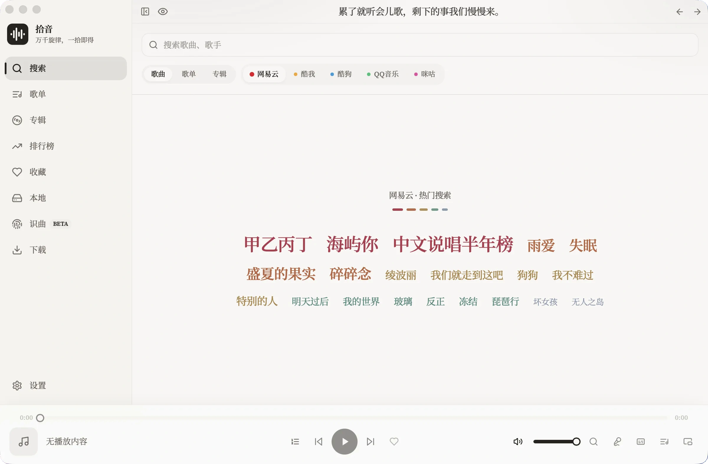
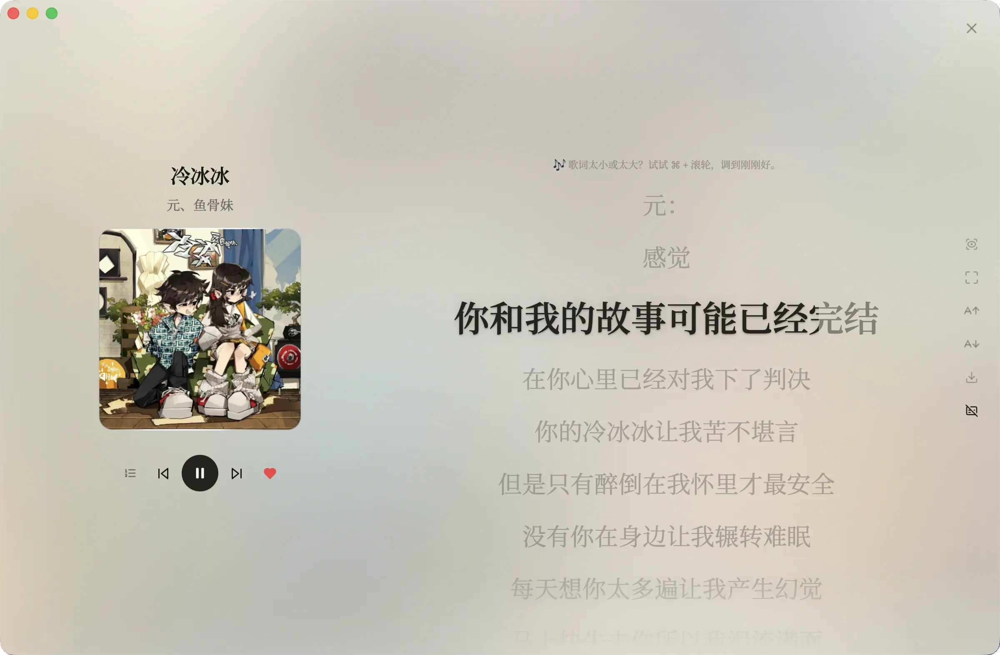
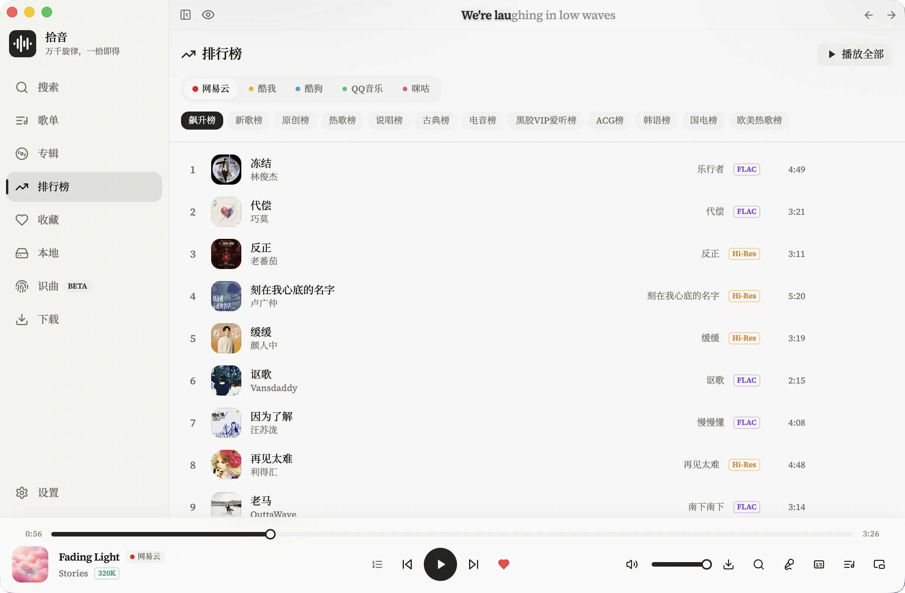
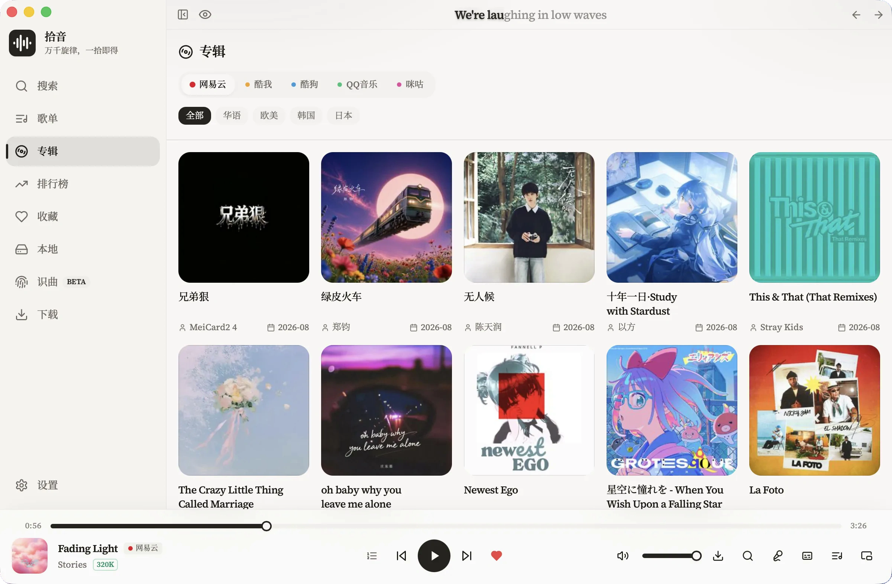
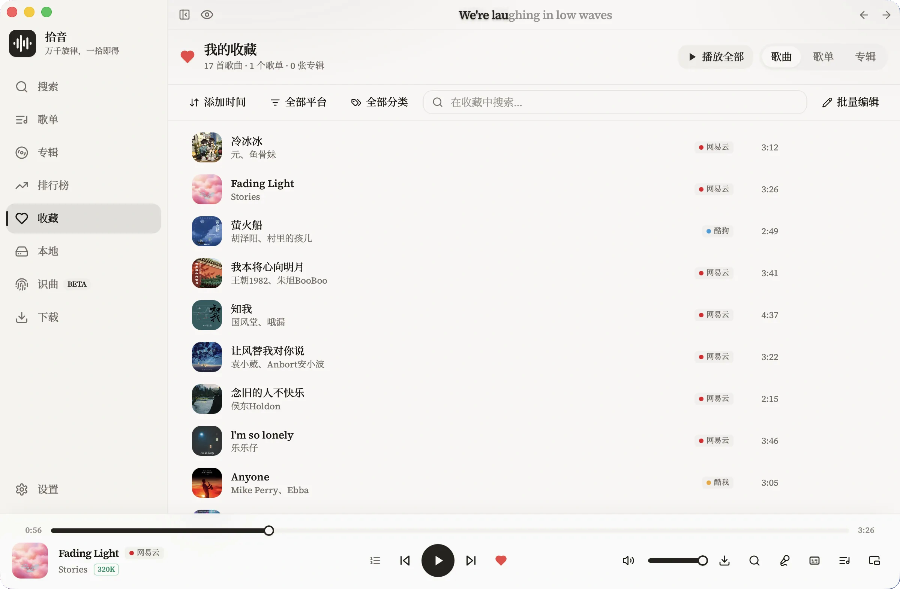
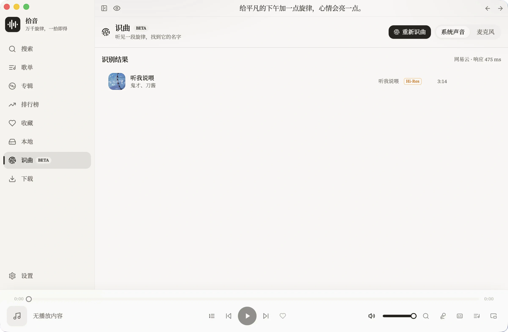
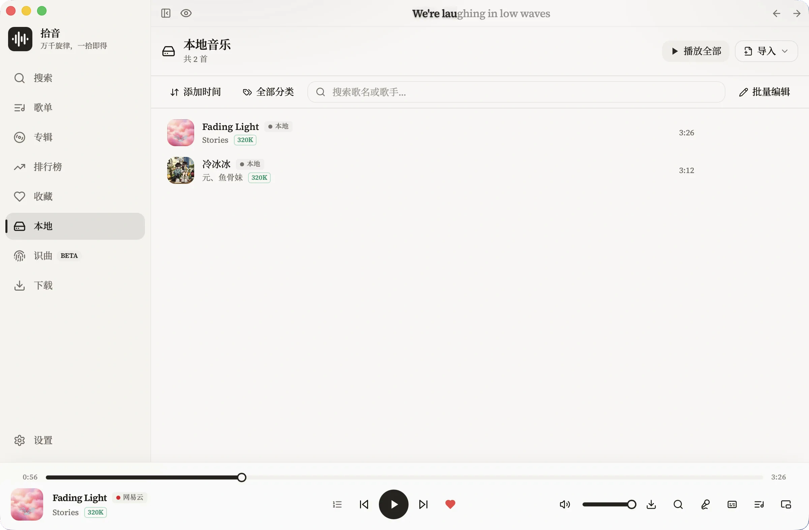
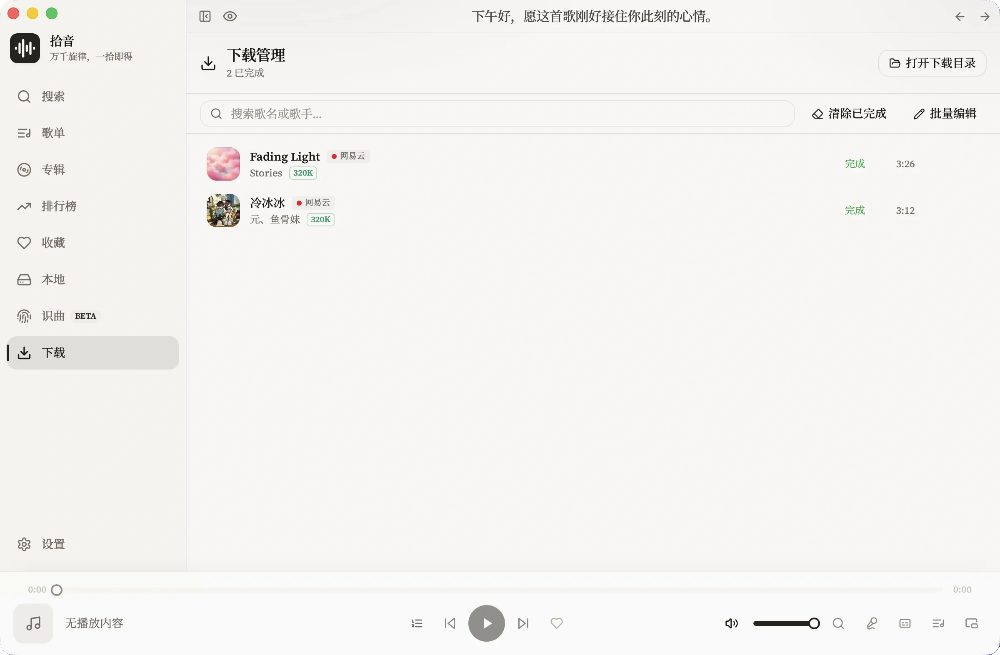

<div align="center">


# Museek · 拾音

**Every melody, one search.**<br>
万千旋律，一拾即得。

<p>
   
   
   
   
   <a href="https://github.com/aeroray/Museek/releases"></a>
</p>

<p>
   <a href="#get-started">Get started · 快速开始</a> ·
   <a href="#features">Features · 功能</a> ·
   <a href="#development">Development · 开发</a> ·
   <a href="#data-and-privacy">Data and privacy · 数据与隐私</a>
</p>

</div>

Museek is a desktop music aggregator for discovering songs, playlists, albums, charts, lyrics, and local files in one place. Online discovery covers **NetEase, KuWo, KuGou, QQ Music, and Migu**. The app is built for desktop use with Tauri and currently publishes verified release artifacts for Windows and Apple Silicon macOS.

拾音是一款桌面音乐聚合应用，将单曲、歌单、专辑、排行榜、歌词和本地音乐放在一个工作流里。在线内容覆盖**网易云、酷我、酷狗、QQ 音乐和咪咕**。项目基于 Tauri 构建，目前提供 Windows 和 Apple Silicon macOS 的正式发布产物。

> [!IMPORTANT]
> Museek does **not** bundle, host, or distribute music content or public source scripts. Search and discovery use platform APIs; playback and download coverage depends primarily on lx-music-compatible source scripts that **you** import. Source scripts are executable code, so only import scripts you trust.
>
> 拾音**不内置、不托管、不分发**音乐内容或公开音源脚本。搜索和内容发现使用各平台 API；播放和下载能力主要取决于**你自行导入**的兼容 lx-music 音源。音源脚本会被执行，请只导入你信任的脚本。

> [!NOTE]
> The current release pipeline publishes a Windows x64 NSIS installer and an Apple Silicon macOS DMG. macOS releases require macOS 13 or later. Linux packages are not currently published by this repository.
>
> 当前发布流程提供 Windows x64 NSIS 安装包和 Apple Silicon macOS DMG；macOS 需要 13 或更高版本。本仓库目前没有发布 Linux 安装包。

## Screenshots · 界面

The following previews were captured on macOS.
以下界面截图来自 macOS。

<div align="center">



**Search across five platforms · 五平台搜索**

</div>

|  |  |
| :---------------------------------------------------------------------------------: | :-----------------------------------------------------------------------------: |
|                  **Fullscreen synchronized lyrics · 全屏同步歌词**                  |                    **Desktop lyrics overlay · 桌面歌词窗口**                    |

|  |  |
| :---------------------------------------------------------------: | :--------------------------------------------------------------------------: |
|                   **Hot playlists · 热门歌单**                    |                  **Charts across platforms · 多平台排行榜**                  |

|  |  |
| :------------------------------------------------------------------------: | :-----------------------------------------------------------------: |
|                  **Albums across platforms · 多平台专辑**                  |                   **Favorites library · 收藏库**                    |

|  |  |  |
| :----------------------------------------------------------------------------: | :---------------------------------------------------------------------------: | :------------------------------------------------------------------: |
|                   **Song recognition beta · Beta 听歌识曲**                    |                     **Local music library · 本地音乐库**                      |                   **Download manager · 下载管理**                    |

<a id="features"></a>

## Features · 功能

| Area          | Highlights                                                                                                                                                                                                            | 功能概览                                                                                                                             |
| ------------- | --------------------------------------------------------------------------------------------------------------------------------------------------------------------------------------------------------------------- | ------------------------------------------------------------------------------------------------------------------------------------ |
| **Discover**  | Search songs, playlists, and albums across five platforms. Keep search history, browse hot-search keywords, charts, hot playlists, and hot albums.                                                                    | 五平台搜索单曲、歌单和专辑；保留搜索历史，查看热搜词、排行榜、热门歌单和热门专辑。                                                   |
| **Sources**   | Import lx-music-compatible `.js` sources from URLs or local files. Enable, disable, reorder, and use multiple sources for playback failover.                                                                          | 支持从链接或本地文件导入兼容 lx-music 的 `.js` 音源，可启用、停用、排序，并使用多音源失败转移。                                      |
| **Player**    | Queue, shuffle/repeat modes, quality selection with adaptive downgrade, synced LRC/karaoke lyrics, fullscreen lyrics, desktop lyrics, mini player, keyboard shortcuts, OS media controls, and prevent-sleep playback. | 播放队列、随机/循环、音质选择与自动降级、同步 LRC / 卡拉 OK 歌词、歌词全屏、桌面歌词、迷你播放器、快捷键、系统媒体控制和播放防休眠。 |
| **Library**   | Favorite songs, playlists, and albums. Organize favorites and local tracks with categories. Import local `mp3`, `flac`, `m4a`, `ogg`, `wav`, and `aac` files or folders.                                              | 收藏单曲、歌单和专辑；用分类整理收藏与本地音乐；导入 `mp3`、`flac`、`m4a`、`ogg`、`wav`、`aac` 文件或文件夹。                        |
| **Downloads** | Batch downloads with configurable quality, concurrency, filename patterns, and optional lyric/cover embedding where the format supports it.                                                                           | 支持批量下载，可设置音质、并发数、文件命名方式，并在格式支持时嵌入歌词和封面。                                                       |
| **Desktop**   | Light/dark/system themes, multiple palettes, English/Simplified Chinese UI, tray behavior, launch at login, in-app updates, JSON import/export, encrypted folder backup, and beta song recognition.                   | 支持浅色/深色/跟随系统、多套配色、中英文界面、托盘行为、开机启动、应用内更新、JSON 导入导出、加密文件夹备份和 Beta 听歌识曲。        |

### Song recognition · 听歌识曲

The **Recognize** page is currently marked Beta. It can capture microphone audio, and on supported Windows/macOS desktop builds it can also capture system audio. The current recognition provider is NetEase.

**听歌识曲**页面目前处于 Beta 状态。支持麦克风采集；在支持的 Windows/macOS 桌面版本中，也可以采集系统声音。目前使用网易云识别服务。

<a id="how-sources-work"></a>

## How sources work · 音源如何工作

Museek separates **discovery** from **playback**. The same flow in Chinese is shown alongside each step below.

拾音将**内容发现**和**播放解析**分开，下面按步骤列出中英文对应说明。

| Step                    | English                                                                                                                    | 中文                                                                                  |
| ----------------------- | -------------------------------------------------------------------------------------------------------------------------- | ------------------------------------------------------------------------------------- |
| **1. Discover**         | Platform adapters fetch search results, charts, playlists, albums, covers, and other public metadata.                      | **1. 内容发现**：平台适配器获取搜索结果、排行榜、歌单、专辑、封面和其他公开元数据。   |
| **2. Resolve**          | Imported lx-music-compatible scripts resolve playable URLs and, where available, lyrics or covers.                         | **2. 音源解析**：导入的兼容 lx-music 音源解析播放地址，并在可用时提供歌词或封面。     |
| **3. Play or download** | Museek validates the returned audio URL, chooses the best available quality, and sends it to the player or download queue. | **3. 播放或下载**：拾音校验返回的音频地址，选择可用的最佳音质，交给播放器或下载队列。 |

<a id="get-started"></a>

## Get started · 快速开始

### Download · 下载

Download the latest published build from [GitHub Releases](https://github.com/aeroray/Museek/releases).<br>
从 [GitHub Releases](https://github.com/aeroray/Museek/releases) 下载最新版本。

| Platform / 平台     | Artifact / 安装包                           | Notes / 说明                                                                                                                                                   |
| ------------------- | ------------------------------------------- | -------------------------------------------------------------------------------------------------------------------------------------------------------------- |
| Windows x64         | NSIS `.exe` installer<br>NSIS `.exe` 安装包 | The installer follows the system language: English or Simplified Chinese.<br>安装界面会跟随系统语言，在英文和简体中文之间切换。                                |
| macOS Apple Silicon | `.dmg`                                      | Requires macOS 13 or later. In-app updates use updater artifacts from the same release.<br>需要 macOS 13 或更高版本；应用内更新使用同一 Release 中的更新产物。 |

### First play · 第一次播放

| Step  | English                                                                                                                                                 | 中文                                                                                                       |
| ----- | ------------------------------------------------------------------------------------------------------------------------------------------------------- | ---------------------------------------------------------------------------------------------------------- |
| **1** | Open **Settings -> Sources** and import one or more trusted lx-music-compatible `.js` sources by URL or local file. Enable the sources you want to use. | 打开**设置 -> 音源管理**，通过链接或本地文件导入一个或多个可信的兼容 lx-music 音源，并启用需要使用的音源。 |
| **2** | Search for a song, or open **Charts**, **Playlists**, or **Albums**.                                                                                    | 搜索歌曲，或打开**排行榜、歌单、专辑**。                                                                   |
| **3** | Play, open synced lyrics, add tracks to favorites, or send them to the download queue.                                                                  | 播放歌曲、打开同步歌词、加入收藏，或发送到下载队列。                                                       |
| **4** | Set a download folder in **Settings -> Download** before downloading. Press `P` or use the player action to open the mini player.                       | 下载前先在**设置 -> 下载**选择下载目录；按 `P` 或点击播放器操作打开迷你播放器。                            |
| **5** | Use **Settings -> Data** for JSON export/import or folder-based backup and restore.                                                                     | 在**设置 -> 数据**中使用 JSON 导入导出，或进行文件夹备份与恢复。                                           |

<a id="development"></a>

## Development · 开发

### Prerequisites · 环境

| English                                                                                                                             | 中文                                                                                                     |
| ----------------------------------------------------------------------------------------------------------------------------------- | -------------------------------------------------------------------------------------------------------- |
| [Node.js 22](https://nodejs.org/) and [pnpm 9](https://pnpm.io/). The versions are pinned in `mise.toml` and CI.                    | [Node.js 22](https://nodejs.org/) 和 [pnpm 9](https://pnpm.io/)，版本已在 `mise.toml` 和 CI 中固定。     |
| [Rust stable](https://www.rust-lang.org/tools/install) through `rustup`.                                                            | 通过 `rustup` 安装 [Rust stable](https://www.rust-lang.org/tools/install)。                              |
| Tauri 2 [system prerequisites](https://tauri.app/start/prerequisites/). On Windows this includes WebView2 and the MSVC build tools. | Tauri 2 的[系统依赖](https://tauri.app/start/prerequisites/)；Windows 还需要 WebView2 和 MSVC 构建工具。 |
| On Apple Silicon macOS, install the `aarch64-apple-darwin` Rust target for native release builds.                                   | 在 Apple Silicon macOS 上构建原生 Release，需要安装 `aarch64-apple-darwin` Rust target。                 |

If you use [mise](https://mise.jdx.dev/), the repository already pins Node and pnpm.<br>
如果使用 [mise](https://mise.jdx.dev/)，仓库已经固定了 Node.js 和 pnpm 版本：

```bash
mise trust
mise install
```

### Run locally · 本地运行

```bash
pnpm install

# Browser-only frontend preview / 仅前端预览
pnpm dev

# Tauri desktop development / Tauri 桌面开发
pnpm tauri dev
```

`pnpm dev` is useful for frontend work, but native features such as the tray, local files, system media capture, and desktop windows require `pnpm tauri dev`.

`pnpm dev` 适合前端开发；托盘、本地文件、系统声音采集和桌面窗口等原生功能需要使用 `pnpm tauri dev`。

### Validate and build · 检查与构建

```bash
# Type-check only / 仅类型检查
pnpm exec tsc --noEmit

# Type-check and build frontend assets / 类型检查并构建前端资源
pnpm build

# Build desktop bundles for the current platform / 构建当前平台的桌面产物
pnpm tauri build
```

Build output is written under `src-tauri/target/*/release/bundle/`.

构建产物会写入 `src-tauri/target/*/release/bundle/`。

### Release builds · 发布构建

```bash
# Windows x64 NSIS installer / Windows x64 NSIS 安装包
pnpm tauri build -- --bundles nsis

# Apple Silicon macOS app and DMG / Apple Silicon macOS 应用和 DMG
pnpm tauri build -- --target aarch64-apple-darwin --bundles app,dmg
```

The GitHub Actions release workflow runs for tags matching `v*`, creates a draft GitHub Release, and produces Windows NSIS and Apple Silicon macOS artifacts. Signed updater artifacts and `latest.json` require the configured `TAURI_SIGNING_PRIVATE_KEY` CI secret (and an optional password secret). Publish the draft release before clients can discover the update.

GitHub Actions 发布流程会响应匹配 `v*` 的 tag，创建 Draft GitHub Release，并生成 Windows NSIS 和 Apple Silicon macOS 产物。签名更新产物和 `latest.json` 需要配置 CI secret `TAURI_SIGNING_PRIVATE_KEY`（以及可选的密码 secret）；发布 Draft 后，客户端才能发现更新。

## Updates · 应用内更新

Museek checks for updates after launch and exposes manual checks under **Settings -> About**. When a release contains the signed updater artifacts, select **Install update** in the About page to update in place.

拾音启动后会检查更新，也可以在**设置 -> 关于**手动检查。Release 包含签名更新产物时，可在关于页面点击**安装更新**完成应用内升级。

<a id="data-and-privacy"></a>

## Data and privacy · 数据与隐私

### What is exported or synced · 导出与同步范围

| English                                                                                                                                                              | 中文                                                                                 |
| -------------------------------------------------------------------------------------------------------------------------------------------------------------------- | ------------------------------------------------------------------------------------ |
| JSON export/import and folder backup cover app configuration such as source settings, favorites/playlists, search history, language, theme, and related preferences. | JSON 导入导出和文件夹备份会处理音源设置、收藏/歌单、搜索历史、语言、主题等应用配置。 |
| They intentionally do **not** move downloaded audio files or media cache.                                                                                            | 不会转移下载文件或媒体缓存。                                                         |
| They intentionally do **not** move the local music library and local categories.                                                                                     | 不会转移本地音乐库和本地分类。                                                       |
| They intentionally do **not** move download queue state, volume/mute, mini-player position, or desktop-lyrics geometry.                                              | 不会转移下载队列、音量/静音、迷你播放器位置或桌面歌词窗口位置。                      |
| They intentionally do **not** move device-specific paths and startup settings such as the download folder.                                                           | 不会转移下载目录等设备相关路径和启动设置。                                           |

### Folder backup warning · 文件夹同步说明

Folder backup writes an encrypted `museek-config.enc.json` file to a folder you choose, which can then be synchronized by OneDrive, iCloud Drive, Dropbox, or another file-sync service. The current implementation uses an app-provided built-in encryption key, not a passphrase that you control. Treat it as encrypted transport and convenience backup, not as a user-controlled end-to-end secret store.

文件夹备份会将加密的 `museek-config.enc.json` 写入你选择的目录，可配合 OneDrive、iCloud Drive、Dropbox 等同步服务使用。当前实现使用应用内置的加密密钥，而不是由用户设置的密码；请把它视为加密传输和便捷备份，不要当作用户可控的端到端机密存储。

## Important notes · 重要说明

Museek is intended for **personal study and research**. It does not provide, host, or distribute music content. You are responsible for the source scripts you import, the platforms and endpoints you access, and your use of any returned media links. Respect each platform’s terms, copyright rules, and applicable laws. Do not use the application commercially without the necessary rights.

本项目**仅供个人学习与研究**。拾音不提供、不存储、不分发音乐内容。你需要对自行导入的音源脚本、访问的平台和接口，以及返回的媒体链接承担责任。请遵守各平台条款、版权规则和适用法律；未经授权请勿用于商业用途。

## Tech stack · 技术栈

| English                                                                                                                                                    | 中文                                                                                                                                                   |
| ---------------------------------------------------------------------------------------------------------------------------------------------------------- | ------------------------------------------------------------------------------------------------------------------------------------------------------ |
| **[Tauri 2](https://tauri.app/)** and Rust for the native desktop shell, filesystem access, tray, updater, and OS media integration.                       | 使用 **[Tauri 2](https://tauri.app/)** 和 Rust 构建桌面外壳，处理文件系统、托盘、更新器和系统媒体集成。                                                |
| **[React 19](https://react.dev/)**, **[TypeScript](https://www.typescriptlang.org/)**, and **[Vite](https://vitejs.dev/)** for the frontend.               | 使用 **[React 19](https://react.dev/)、[TypeScript](https://www.typescriptlang.org/)** 和 **[Vite](https://vitejs.dev/)** 构建前端。                   |
| **[Tailwind CSS](https://tailwindcss.com/)**, Radix primitives, **[Zustand](https://zustand-demo.pmnd.rs/)**, and React Router for the UI and state model. | 使用 **[Tailwind CSS](https://tailwindcss.com/)**、Radix primitives、**[Zustand](https://zustand-demo.pmnd.rs/)** 和 React Router 构建界面与状态模型。 |
| Web Crypto and focused format/crypto helpers for local metadata, lyrics, source formats, cache, and encrypted configuration backup.                        | 使用 Web Crypto 及相关格式/加密工具处理本地元数据、歌词、音源格式、缓存和加密配置备份。                                                                |

## Updates and community · 更新与交流

The project website is available at [aeroray.github.io/Museek](https://aeroray.github.io/Museek/). For source links and project updates, scan the QR code or follow the project’s public channels.

项目主页：[aeroray.github.io/Museek](https://aeroray.github.io/Museek/)。音源链接和项目更新可通过扫码关注公众号获取。

<div align="center">


</div>
